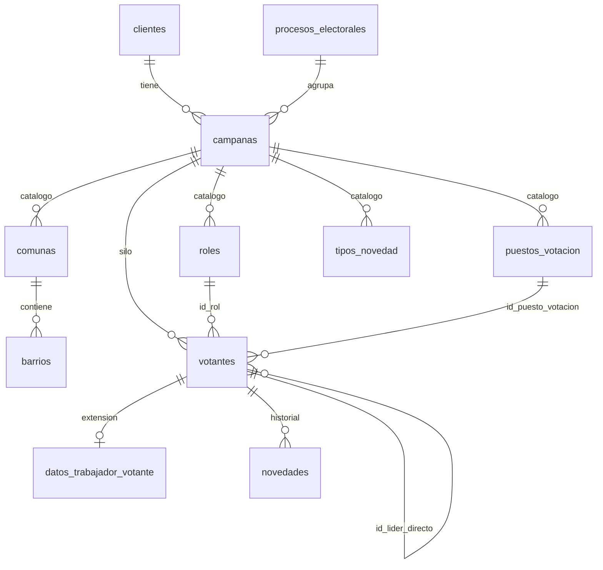

# Diccionario de datos — Plataforma de Campañas

Documento de referencia para entender **qué es cada tabla, cada campo y para qué sirve** en el negocio.

**Migraciones:** `001_platform_core.sql` + `002_domain_schema.sql`  
**Idioma:** tablas y columnas en español  
**Última actualización:** 2026-06-14 (roles app: lector/editor/admin; estados y tipos simplificados)

---

## Cómo leer este diccionario

| Columna del diccionario | Significado |
|-------------------------|-------------|
| **Campo** | Nombre en la base de datos |
| **Tipo** | Tipo de dato Postgres |
| **Obligatorio** | Si debe tener valor al crear el registro |
| **Función** | Para qué existe en la operación de campaña |

**Alcance por campaña:** cuando un catálogo lleva `id_campana`, cada político arma el suyo; no se comparte con otras campañas.

---

## Tipos enumerados (valores permitidos)

### `estado_campana`
Ciclo de vida de una campaña electoral.

| Valor | Significado |
|-------|-------------|
| `activa` | En operación: captura de votantes, cuarentena, stats |
| `pausada` | Suspendida temporalmente; no se borran datos |
| `finalizada` | Elección/proceso cerrado; disponible export ZIP |
| `purgada` | Datos operativos eliminados; queda solo historial mínimo |

### `rol_plataforma`
Quién administra todo el SaaS.

| Valor | Significado |
|-------|-------------|
| `dueno_plataforma` | Dueño del producto: crea clientes, campañas, asigna usuarios, ve gastos |

### `rol_miembro_campana`
Permiso de **acceso a la aplicación** (no confundir con `roles` del votante).

| Valor | Significado |
|-------|-------------|
| `lector` | Solo consulta datos de la campaña |
| `editor` | Consulta y edita registros (captura, novedades, etc.) |
| `administrador_campana` | Administra la campaña del político (máximo nivel en app) |

### `proveedor_integracion`
Servicio externo configurado por campaña.

| Valor | Significado |
|-------|-------------|
| `twilio` | WhatsApp / mensajería |
| `resolutor_captcha` | CAPTCHA Solver + consulta registraduría |
| `telegram` | Bot de Telegram |
| `ia_e14` | Análisis IA de formularios E14 |

### `tipo_documento`
Documento de identidad del votante o cliente.

| Valor | Significado |
|-------|-------------|
| `CC` | Cédula de ciudadanía |
| `TI` | Tarjeta de identidad |
| `CE` | Cédula de extranjería |
| `PA` | Pasaporte |
| `PEP` | Permiso especial de permanencia |
| `PPT` | Permiso por protección temporal |

### `tipo_sexo`
Sexo registrado del votante.

| Valor | Significado |
|-------|-------------|
| `Masculino` | Masculino |
| `Femenino` | Femenino |

### `estado_votante`
Estado del registro en el flujo operativo.

| Valor | Significado |
|-------|-------------|
| `pendiente_verificacion` | Esperando consulta registraduría (CAPTCHA Solver) |
| `activo` | Válido en base maestra de la campaña |
| `en_cuarentena` | Conflicto/duplicado; pendiente decisión |
| `rechazado` | Descartado tras revisión |

### `canal_captura`
Por dónde entró el registro del votante.

| Valor | Significado |
|-------|-------------|
| `whatsapp` | Bot WhatsApp (Twilio) |
| `telegram` | Bot Telegram |
| `web` | Formulario web autenticado |
| `web_publico` | Formulario por enlace/token sin login |
| `manual` | Carga manual en panel |

---

## Funciones de base de datos

| Función | Retorna | Función de negocio |
|---------|---------|-------------------|
| `es_dueno_plataforma()` | boolean | ¿El usuario logueado es dueño del SaaS? Acceso total |
| `ids_campanas_usuario()` | lista de UUID | Campañas donde el usuario tiene membresía |
| `puede_leer_campana(id)` | boolean | Miembro de la campaña (cualquier rol) o dueño |
| `puede_editar_campana(id)` | boolean | Rol `editor` o `administrador_campana`, o dueño |
| `puede_administrar_campana(id)` | boolean | Rol `administrador_campana` o dueño |
| `establecer_actualizado_en()` | trigger | Pone `actualizado_en = now()` al editar |
| `crear_caracteristicas_campana()` | trigger | Al crear campaña, crea fila en `caracteristicas_campana` |
| `validar_lider_misma_campana()` | trigger | El líder directo debe ser votante de la misma campaña |
| `subarbol_votantes(id_votante_raiz)` | ids + profundidad | Todos los votantes **debajo** de un líder en el árbol (para stats por jerarquía) |

### Matriz RLS por rol (dominio electoral)

| Acción | `lector` | `editor` | `administrador_campana` | `dueno_plataforma` |
|--------|----------|----------|-------------------------|-------------------|
| Leer votantes, catálogos, novedades | ✅ | ✅ | ✅ | ✅ |
| Crear/editar votantes, novedades, catálogos | ❌ | ✅ | ✅ | ✅ |
| Eliminar votantes, catálogos | ❌ | ❌ | ✅ | ✅ |
| Crear campañas, clientes, integraciones | ❌ | ❌ | ❌ | ✅ |

> La app usa el **anon key** con sesión Auth; RLS aplica automáticamente según el usuario logueado.

---

## Módulo plataforma (001)

### `procesos_electorales`
Agrupa campañas de la **misma elección** (ej. Presidencia 2026). Sirve para compartir análisis E14 entre campañas que contrataron el módulo.

| Campo | Tipo | Obl. | Función |
|-------|------|------|---------|
| `id` | uuid | Sí | Identificador único del proceso electoral |
| `nombre` | text | Sí | Nombre legible (ej. "Presidencia 2026", "Alcaldía Medellín 2027") |
| `fecha_eleccion` | date | No | Fecha de la votación |
| `creado_en` | timestamptz | Sí | Cuándo se registró en el sistema |

---

### `clientes`
El **político u organización recurrente**. Puede tener varias campañas a lo largo de los años; la cuenta persiste aunque se purguen campañas viejas.

| Campo | Tipo | Obl. | Función |
|-------|------|------|---------|
| `id` | uuid | Sí | Identificador del cliente |
| `nombre` | text | Sí | Nombre del cliente / candidato / organización |
| `documento` | text | No | Documento de identidad del cliente |
| `telefono` | text | No | Teléfono de contacto comercial |
| `correo_contacto` | text | No | Correo de contacto |
| `notas` | text | No | Observaciones internas del dueño de plataforma |
| `creado_en` | timestamptz | Sí | Alta del cliente |
| `actualizado_en` | timestamptz | Sí | Última modificación |

---

### `campanas`
Una **elección concreta** de un cliente. Aquí viven votantes, catálogos, cuarentena y stats. Es el **silo de aislamiento** principal (`id_campana` en casi todo).

| Campo | Tipo | Obl. | Función |
|-------|------|------|---------|
| `id` | uuid | Sí | Identificador de la campaña |
| `id_cliente` | uuid | Sí | A qué cliente (político) pertenece |
| `id_proceso_electoral` | uuid | Sí | A qué elección/proceso corresponde |
| `nombre` | text | Sí | Nombre operativo (ej. "Senado 2026 — Candidato X") |
| `estado` | estado_campana | Sí | Ciclo: activa → pausada → finalizada → purgada |
| `iniciado_en` | timestamptz | No | Cuándo empezó operación |
| `finalizado_en` | timestamptz | No | Cuándo se marcó como finalizada |
| `purgado_en` | timestamptz | No | Cuándo el dueño ejecutó purga irreversible |
| `creado_en` | timestamptz | Sí | Alta de la campaña |
| `actualizado_en` | timestamptz | Sí | Última modificación de metadatos |

---

### `miembros_plataforma`
Usuarios que son **dueños del SaaS** (ustedes). Acceden a `/platform`.

| Campo | Tipo | Obl. | Función |
|-------|------|------|---------|
| `id_usuario` | uuid | Sí | Usuario Supabase Auth (PK) |
| `rol` | rol_plataforma | Sí | Siempre `dueno_plataforma` en MVP |
| `creado_en` | timestamptz | Sí | Cuándo se otorgó acceso de plataforma |

---

### `miembros_campana`
Usuarios del **equipo del político** asignados a una campaña. Controlan qué pantallas y datos ven en la app.

| Campo | Tipo | Obl. | Función |
|-------|------|------|---------|
| `id` | uuid | Sí | Identificador del vínculo |
| `id_campana` | uuid | Sí | Campaña a la que accede |
| `id_usuario` | uuid | Sí | Usuario Supabase Auth |
| `rol` | rol_miembro_campana | Sí | Permiso en la app (lector, editor, administrador_campana) |
| `creado_en` | timestamptz | Sí | Cuándo el dueño lo asignó |

**Regla:** un usuario solo ve datos de campañas donde tiene fila aquí (o es `dueno_plataforma`).

---

### `miembros_cliente`
Vínculo opcional usuario ↔ cliente, para re-asignar personas entre campañas del mismo político sin perder historial de relación.

| Campo | Tipo | Obl. | Función |
|-------|------|------|---------|
| `id` | uuid | Sí | Identificador |
| `id_cliente` | uuid | Sí | Cliente |
| `id_usuario` | uuid | Sí | Usuario |
| `creado_en` | timestamptz | Sí | Fecha de vínculo |

---

### `caracteristicas_campana`
**Módulos contratados** por campaña (feature flags). Permite encender/apagar CAPTCHA, E14, WhatsApp, etc. sin redeploy.

| Campo | Tipo | Obl. | Función |
|-------|------|------|---------|
| `id_campana` | uuid | Sí | Campaña (PK, 1 fila por campaña) |
| `resolutor_captcha` | boolean | Sí | ¿Verificación registraduría activa? |
| `auditoria_e14` | boolean | Sí | ¿El cliente ve módulo E14? |
| `whatsapp` | boolean | Sí | ¿Canal WhatsApp habilitado? |
| `telegram` | boolean | Sí | ¿Canal Telegram habilitado? |
| `captura_web` | boolean | Sí | ¿Formularios web habilitados? |
| `actualizado_en` | timestamptz | Sí | Último cambio de módulos |

---

### `integraciones_campana`
Credenciales **por campaña** (Twilio, CAPTCHA, etc.). Solo visible para dueños de plataforma.

| Campo | Tipo | Obl. | Función |
|-------|------|------|---------|
| `id` | uuid | Sí | Identificador |
| `id_campana` | uuid | Sí | Campaña dueña de la integración |
| `proveedor` | proveedor_integracion | Sí | Qué servicio (twilio, resolutor_captcha…) |
| `configuracion_cifrada` | text | Sí | JSON con API keys, números, tokens (cifrar en app) |
| `activa` | boolean | Sí | Si la integración está en uso |
| `creado_en` | timestamptz | Sí | Alta |
| `actualizado_en` | timestamptz | Sí | Última rotación de credenciales |

---

### `uso_campana`
**Consumo interno** por campaña (mensajes, consultas CAPTCHA, tokens IA). Solo dueños — el político no ve esto.

| Campo | Tipo | Obl. | Función |
|-------|------|------|---------|
| `id` | uuid | Sí | Identificador |
| `id_campana` | uuid | Sí | Campaña medida |
| `proveedor` | proveedor_integracion | Sí | De qué servicio es el consumo |
| `metrica` | text | Sí | Qué se midió (ej. `mensajes_wa`, `consultas_cedula`) |
| `cantidad` | numeric | Sí | Valor acumulado |
| `periodo_inicio` | timestamptz | No | Inicio del periodo facturado |
| `periodo_fin` | timestamptz | No | Fin del periodo |
| `registrado_en` | timestamptz | Sí | Cuándo se registró el dato |

---

### `exportaciones_campana`
Registro de cada **ZIP entregado** al político al cerrar campaña.

| Campo | Tipo | Obl. | Función |
|-------|------|------|---------|
| `id` | uuid | Sí | Identificador |
| `id_campana` | uuid | Sí | Campaña exportada |
| `exportado_por` | uuid | No | Usuario dueño que generó el export |
| `ruta_almacenamiento` | text | Sí | Path en Supabase Storage del ZIP |
| `tamano_archivo` | bigint | No | Tamaño en bytes |
| `creado_en` | timestamptz | Sí | Cuándo se generó |

---

### `configuracion_marca_plataforma`
**Branding único** del SaaS (logo, colores). Una sola fila (`id = 1`). No es personalizable por político.

| Campo | Tipo | Obl. | Función |
|-------|------|------|---------|
| `id` | int | Sí | Siempre `1` (singleton) |
| `url_logo` | text | No | URL del logo en storage |
| `color_primario` | text | No | Color principal UI (hex) |
| `color_secundario` | text | No | Color secundario UI |
| `familia_fuente` | text | No | Tipografía (ej. Inter) |
| `actualizado_en` | timestamptz | Sí | Último cambio de marca |

---

### `registro_auditoria`
Trazabilidad de acciones importantes (cambios de estado, asignaciones, fusiones en cuarentena).

| Campo | Tipo | Obl. | Función |
|-------|------|------|---------|
| `id` | uuid | Sí | Identificador |
| `id_actor` | uuid | No | Quién hizo la acción (usuario Auth) |
| `accion` | text | Sí | Código de acción (ej. `campana.estado.finalizada`) |
| `tipo_entidad` | text | Sí | Qué entidad afectó (campana, votante…) |
| `id_entidad` | uuid | No | ID del registro afectado |
| `id_campana` | uuid | No | Campaña relacionada (si aplica) |
| `metadatos` | jsonb | Sí | Detalle extra (valores antes/después) |
| `creado_en` | timestamptz | Sí | Cuándo ocurrió |

---

## Módulo electoral (002)

### `roles` *(catálogo por campaña)*
Roles **organizacionales del votante** en la estructura de campaña (líder zona, coordinador barrio, etc.). **No** es lo mismo que `miembros_campana.rol` (permisos de app).

| Campo | Tipo | Obl. | Función |
|-------|------|------|---------|
| `id` | uuid | Sí | Identificador del rol |
| `id_campana` | uuid | Sí | Campaña que define este catálogo |
| `nombre` | text | Sí | Nombre del rol (ej. "Líder comuna 5") |
| `nivel_jerarquia` | smallint | Sí | Nivel en el árbol: **1** (más alto) a **3** (más bajo) |
| `creado_en` | timestamptz | Sí | Alta del rol |

---

### `comunas` *(catálogo por campaña)*
División territorial de la campaña (comuna electoral / sector).

| Campo | Tipo | Obl. | Función |
|-------|------|------|---------|
| `id` | uuid | Sí | Identificador |
| `id_campana` | uuid | Sí | Campaña dueña del catálogo |
| `nombre` | text | Sí | Nombre de la comuna |
| `numero` | text | No | Número o código de comuna |
| `creado_en` | timestamptz | Sí | Alta |

---

### `barrios` *(catálogo por campaña)*
Subdivisión dentro de una comuna.

| Campo | Tipo | Obl. | Función |
|-------|------|------|---------|
| `id` | uuid | Sí | Identificador |
| `id_comuna` | uuid | Sí | Comuna a la que pertenece |
| `nombre` | text | Sí | Nombre del barrio |
| `creado_en` | timestamptz | Sí | Alta |

---

### `puestos_votacion` *(catálogo por campaña)*
Puestos de votación según **registraduría** para el proceso de esa campaña. Los cupos H/M son los que oficialmente admite el puesto.

| Campo | Tipo | Obl. | Función |
|-------|------|------|---------|
| `id` | uuid | Sí | Identificador interno |
| `id_campana` | uuid | Sí | Campaña |
| `id_comuna` | uuid | No | Comuna donde queda el puesto |
| `id_barrio` | uuid | No | Barrio referencia |
| `codigo_registraduria` | text | No | Código oficial del puesto en registraduría |
| `nombre` | text | Sí | Nombre del puesto de votación |
| `municipio` | text | No | Ciudad/municipio |
| `direccion` | text | No | Dirección física del puesto |
| `votantes_hombres_admite` | integer | Sí | Cupo habilitado hombres (dato registraduría) |
| `votantes_mujeres_admite` | integer | Sí | Cupo habilitado mujeres (dato registraduría) |
| `cantidad_mesas` | integer | Sí | Número de mesas en el puesto |
| `fuente` | text | Sí | Origen del dato (default `registraduria`) |
| `actualizado_registraduria_en` | timestamptz | Sí | Última vez que se actualizó desde registraduría |
| `creado_en` | timestamptz | Sí | Alta en el sistema |
| `actualizado_en` | timestamptz | Sí | Última edición local |

---

### `tipos_novedad` *(catálogo por campaña)*
Catálogo de tipos de novedad que puede registrar el equipo (cambio de puesto, fallecido, traslado, etc.).

| Campo | Tipo | Obl. | Función |
|-------|------|------|---------|
| `id` | uuid | Sí | Identificador |
| `id_campana` | uuid | Sí | Campaña |
| `novedad` | text | Sí | Descripción del tipo (ej. "Cambió de municipio") |
| `creado_en` | timestamptz | Sí | Alta |

---

### `votantes`
Registro maestro de **simpatizantes/votantes** de la campaña. Forma un **árbol** vía `id_lider_directo`.

| Campo | Tipo | Obl. | Función |
|-------|------|------|---------|
| `id` | uuid | Sí | Identificador del votante |
| `id_campana` | uuid | Sí | Campaña (silo); no se cruza con otras |
| `nombres` | text | Sí | Nombres |
| `apellidos` | text | Sí | Apellidos |
| `documento` | text | Sí | Número de documento (normalizado sin puntos) |
| `tipo_documento` | tipo_documento | Sí | CC, TI, CE, etc. |
| `sexo` | tipo_sexo | No | Sexo para reportes demográficos |
| `fecha_nacimiento` | date | No | Fecha de nacimiento |
| `telefono` | text | No | Teléfono de contacto (ideal E.164 +57) |
| `direccion` | text | No | Dirección de residencia |
| `id_puesto_votacion` | uuid | No | Puesto donde vota (catálogo campaña) |
| `mesa` | text | No | Número o código de mesa |
| `id_rol` | uuid | No | Rol organizacional en la campaña (`roles`) |
| `id_lider_directo` | uuid | No | Otro votante que es su líder inmediato (árbol) |
| `estado` | estado_votante | Sí | Estado en flujo operativo |
| `canal_origen` | canal_captura | Sí | Cómo se capturó (WA, TG, web…) |
| `creado_por` | uuid | No | Usuario que registró (null si web público) |
| `creado_en` | timestamptz | Sí | Fecha de captura |
| `actualizado_en` | timestamptz | Sí | Última modificación |

**Árbol de líderes:** jerarquía 1 en la cima (sin líder o líder raíz); cada votante cuelga de su `id_lider_directo`. Consulta descendientes con `subarbol_votantes(id)`.

**Unicidad:** no puede haber dos registros activos con mismo `documento` + `tipo_documento` en la misma campaña (duplicados van a cuarentena — migración futura).

---

### `datos_trabajador_votante`
Información laboral del votante (dónde trabaja y territorio asignado para campaña).

| Campo | Tipo | Obl. | Función |
|-------|------|------|---------|
| `id` | uuid | Sí | Identificador |
| `id_votante` | uuid | Sí | Votante (1 fila por votante) |
| `lugar_trabajo` | text | No | Nombre del lugar de trabajo |
| `direccion_trabajo` | text | No | Dirección del trabajo |
| `id_comuna` | uuid | No | Comuna asignada para trabajo/campaña |
| `id_barrio` | uuid | No | Barrio asignado |
| `creado_en` | timestamptz | Sí | Alta |
| `actualizado_en` | timestamptz | Sí | Última edición |

---

### `novedades`
Historial de **novedades** sobre un votante (eventos que cambian su situación).

| Campo | Tipo | Obl. | Función |
|-------|------|------|---------|
| `id` | uuid | Sí | Identificador |
| `id_votante` | uuid | Sí | Votante afectado |
| `id_tipo_novedad` | uuid | Sí | Tipo desde catálogo `tipos_novedad` |
| `detalle` | text | No | Texto libre con el detalle de la novedad |
| `creado_por` | uuid | No | Usuario que registró la novedad |
| `creado_en` | timestamptz | Sí | Cuándo se registró |

---

## Relaciones principales

---

## Tablas planificadas (aún no en migraciones)

| Tabla futura | Función |
|--------------|---------|
| `cuarentena_votantes` | Duplicados pendientes de resolver por supervisor |
| `historial_votante` | Cambios campo a campo en votantes |
| `cola_trabajos` | Jobs async (CAPTCHA, E14, export) |

---

## Documentos relacionados

- `supabase/DATABASE-SCHEMA.md` — mapa rápido tablas ↔ concepto PO  
- `supabase/SETUP-DB.md` — cómo aplicar migraciones en Supabase  
- `openspec/changes/plataforma-campanas/DECISIONES-CONFIRMADAS.md` — reglas de negocio
